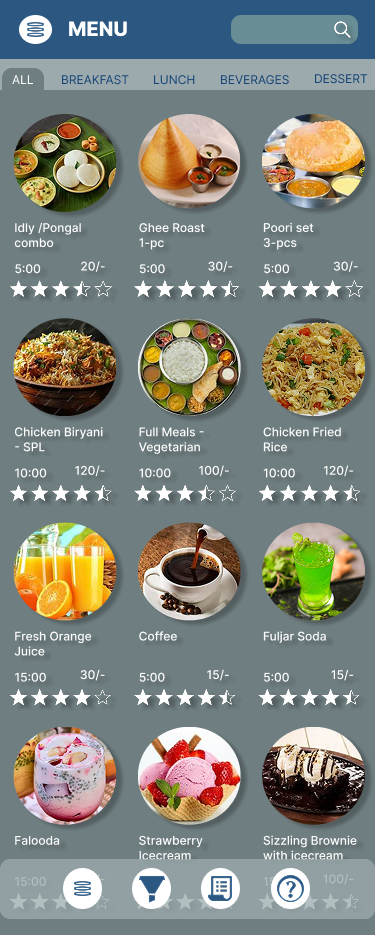
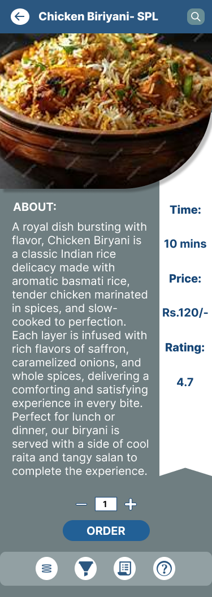
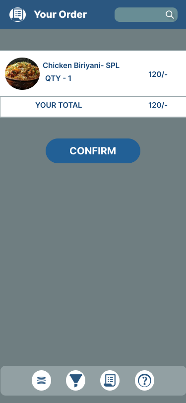

# Task 3 – Restaurant Menu UI/UX

## Description
Designed a restaurant menu app where users can browse categorized dishes, view details, and place orders. Focused on simple navigation and real-world flow for a restaurant setting.

## Tools Used
- Figma

## Preview

## 🔗 Prototype Link
▶️ [Click here to view the prototype](https://www.figma.com/proto/S2WJgbYeHHNb6qtlPVKnJQ/Untitled?node-id=23-360&t=LjghEBIXSgUpPp3q-1)
